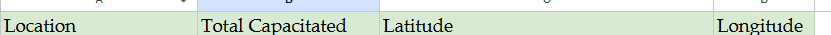
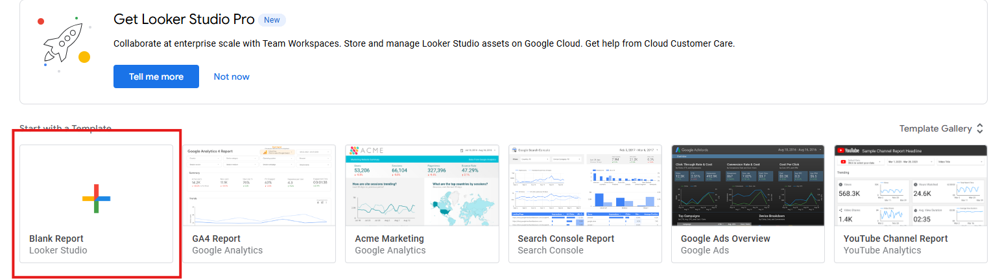
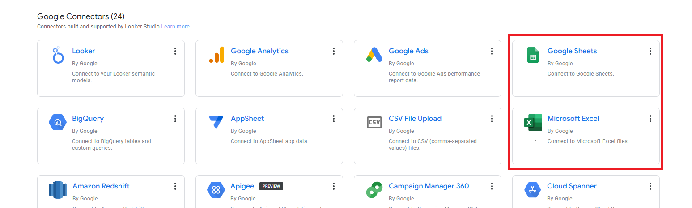
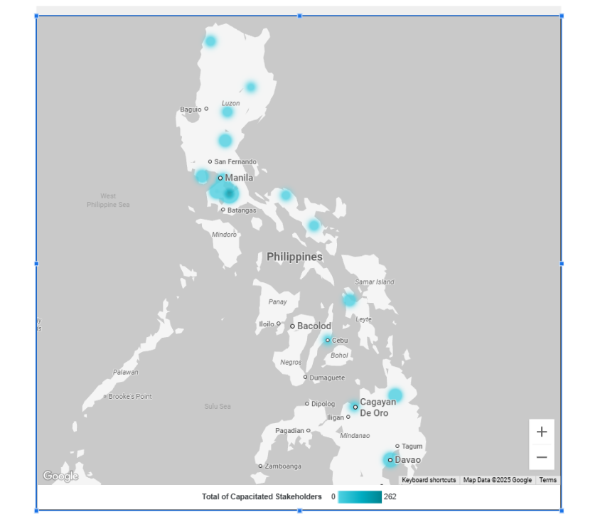
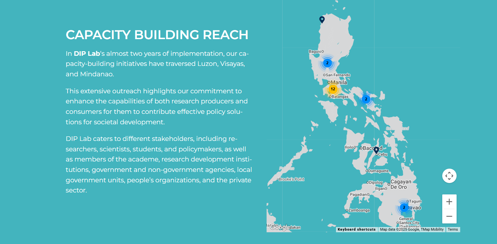

# DIP Lab Training Heat Map

This is a heatmap of DIP Lab capacity-building activities over the past few years. The hotspots represent the ratio of stakeholders capacitated to the locations where the DIP Lab conducted their mentoring programs. The darker the color of the hotspot, the higher the number of people capacitated in that location.

## Setup Instructions

### 1. Create Your Dataset

First, create a Google Spreadsheet for your dataset. It must include the following columns:
- Location name
- Latitude
- Longitude
- Number of stakeholders trained
- Date of training

### 2. Input the Data

Enter your data into the spreadsheet, ensuring all location coordinates and participant numbers are accurate.

### 3. Connect to Looker Studio

Create a blank report and connect your dataset to Looker Studio to enable data visualization and reporting capabilities.

### 4. Choose Your Data Source

You may use either Excel Sheet or Google Sheet as your data source, depending on your preference and workflow.

### 5. Add a Map Chart

Add a Map chart to visually represent the geographic distribution of your training activities.

---

## WordPress Implementation

This heatmap is now implemented on the DIP Lab WordPress site using the Google Maps JavaScript API.

### Implementation Overview

To implement the map on WordPress:

1. **API Integration**: Used the Google Maps JavaScript API to generate an interactive map.

2. **Custom Post Type**: Created a Custom Post Type in WordPress that captures:
   - Training location name
   - Latitude coordinate
   - Longitude coordinate
   - Additional training details

This creates pinned locations on the map, allowing visitors to view all past training sites conducted by the DIP Lab.

---

### Reference:

UPLB DAFX Module

https://drive.google.com/file/d/1_tHZ-L3B2qQJSnEw-I21WuT8UxeYiUaC/view?usp=sharing